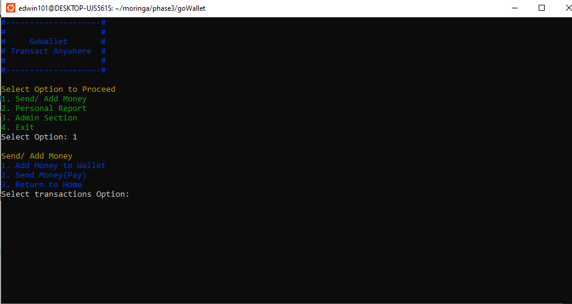
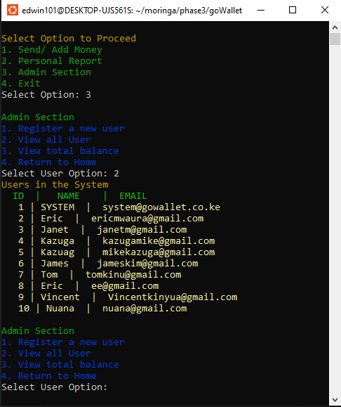

# GoWallet
GoWallet - a digital wallet for those on the 'GO' to help you make payments and receive funds fast and flexibly as well as instantly track all the transactions on your wallet- implemented in OOP Python - also using Click, Sqlite, SQLAlchemy, Alembic - within a PIPENV - Virtural Environment

#### By **Edwin Mwaniki**


## User Stories:

- As a system admin I want to register new users so that the uses can also obtain a digital wallet
- As a user I want to be able to add money to my wallet so that I can also make payments whenever I want.
- As a user I want to be able to view all the transactions I have made over any given time so that I can track my digital wallet usage
- As a system admin I want to be able to view all users and balances at any given time so that I can know the status and performance of the overall system.

## Data Entity Structure:
- Users -> {id, firstname, lastname, emails}
- Wallets -> {id, user_id, balance}
- Transactions -> {id, sender_wallet_id, receiver_wallet_id, timestamp, description, amount}

## Screenshots





## Features

- Main Menu
    - Send/ Add Money
    - Personal Report
    - Admin Section
    - Exit

- Send/ Add Money
   - Add Money to Wallet
   - Send Money(Pay)
   - Return to Home

- Personal Report
   - View Transactions
   - View my balance
   - Return to Home

- Admin Section  
   - Register a new user
   - View all Users
   - View total balance
   - Return to Home

## Extra Features:
- Validation of inputs
   - Validation of user's First Name and Last Name
   - Validation of Initial Balance

## System Requirements
- 

## How to Use

This is a Click() Application
To access it you use either a **Command Prompt** or **Terminal**


The live app allows you to:

- Browse through the Navigation
- View the Dashboard, View the mission operations, view secret communictions
- Also navigate to the Agents, Tools, Reports and view the current time

  
### Local Development

If you want to run the project locally, you'll need:

- Node.js installed on your computer
- Basic understanding of React JS
- Code editor (VS Code recommended)
- Terminal/Command Line

#### Installation Process

1. Clone this repository using:

   ```bash
   git clone git@github.com:edwin3v3/the-mission.git
   ```

   or by downloading a ZIP file of the code.

2. Navigate to the project directory:

   ```bash
   cd the-mission
   ```

3. Install the required dependencies:

   ```bash
   npm install
   ```

4. Run the development server:

   ```bash
   npm run dev
   ```

5. Open your browser and visit `http://localhost:5173`

## Technologies Used

- React JS
- Vite
- CSS3
- JavaScript (ES6)

## Related Repositories

- Github Repository: [Github Repository](https://github.com/edwin3v3/the-mission)
- Live Site using Vercel: [The-Mission](https://the-mission.vercel.app/home)

### Backend API

- Repository: [DBJSON API Repository](https://github.com/edwin3v3/mission-server/tree/main)
- Deployed API: [Live API URL](https://mission-server.onrender.com/missions)

## Support and Contact Details

If you have any questions, suggestions, or need assistance, please contact:

- Email: <shalon.mumbi@student.moringaschool.com>
- Email: <edwin.mwaniki@student.moringaschool.com>
- Email: <jesse.matara@student.moringaschool.com>

## License

MIT License

Copyright &copy; 2025 The Mission - Sharon Mumbi | Edwin Mwaniki | Jesse Matara

Permission is hereby granted, free of charge, to any person obtaining a copy of this software and associated documentation files (the "Software"), to deal in the Software without restriction, including without limitation the rights to use, copy, modify, merge, publish, distribute, sublicense, and/or sell copies of the Software, and to permit persons to whom the Software is furnished to do so, subject to the following conditions: